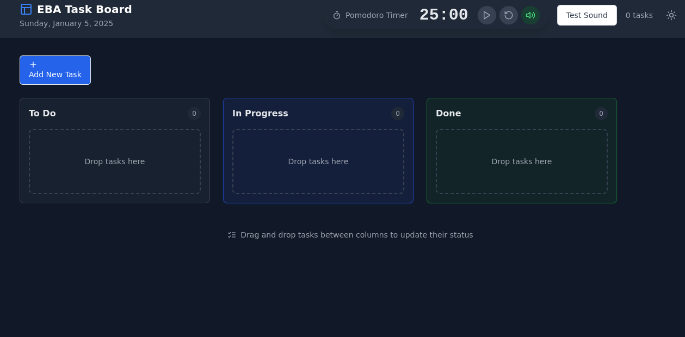

# Task Board

[](LICENSE)    [](https://www.typescriptlang.org/)  [](https://vitejs.dev/)  [](https://tailwindcss.com/)


A modern task management application with Kanban board and integrated Pomodoro timer.   Built with React and TypeScript for optimal productivity.

## Features

- Drag-and-drop Kanban board
- Pomodoro timer with sound notifications
- Dark/light theme support
- Task status tracking (Todo, In Progress, Done)
- Mobile-responsive design
- Persistent storage
- Task descriptions and timestamps
- Sound notifications for completed timers




## Quick Start

```bash
# Install dependencies
npm install

# Start development server
npm run dev

# Build for production
npm run build
```

## Technology Stack

- React 18 with TypeScript
- Tailwind CSS for styling
- DND Kit for drag-and-drop
- Zustand for state management
- Lucide React for icons
- Vite for building and development

## Project Structure

```
src/
├── components/   # React components
│   ├── pomodoro/ # Timer components
│   ├── task/     # Task-related components
│   └── ui/       # Reusable UI components
├── store/        # Zustand stores
├── types/        # TypeScript types
└── utils/        # Utility functions
```


## Creator

Ed Bates (TECHBLIP LLC)

## Acknowledgments

Some sections of this code were generated with the assistance of AI tools.   These contributions were reviewed and integrated by the project creator(s).

## License

Apache-2.0 license - see the [LICENSE](LICENSE) file for details
